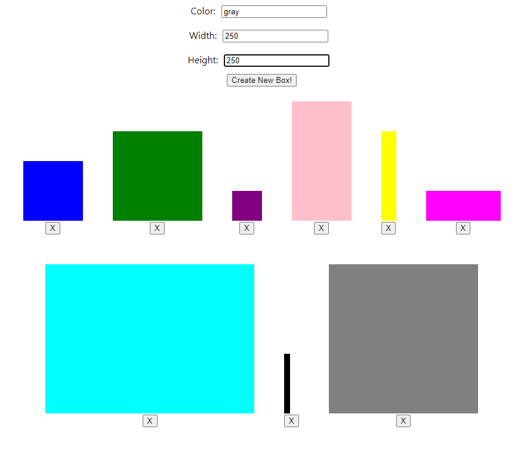

# React - Forms Exercise - Color Box Maker
This app uses controlled components, ie forms, in React to allow a user to enter a color, width, and height to create a box. Boxes may be created, and each box may be deleted. The purpose of this app was to practice working with forms and controlled components in React.

  

## Running the App
1) Clone repo: `git clone https://github.com/mpike91/React-FormsExercise.git`
2) Move into directory: `cd React-FormsExercise/`
3) Install npm: `npm install`
4) Start app: `npm start`

## My Contribution
I was not given any starter code, but I was assigned the various component names to create and what each one should do. I wrote everything myself, building on top of the create-react-app boilerplate.
